**Timestamp:** 2025-11-14 15:45:00 UTC  
**Title:** SPOT-Policy™ for News Articles: Framework, Adaptation, and Application Guidelines

## Executive Summary
**SPOT-Policy™ v7.0**, while originally designed for evaluating policy documents, can be **strategically adapted** to assess **news articles** about policy—particularly those analyzing, interpreting, or critiquing government budgets, legislation, or public initiatives. This adaptation leverages the framework’s core strengths—**Fiscal Transparency (FT)**, **Stakeholder Balance (SB)**, **Economic Rigor (ER)**, **Public Accessibility (PA)**, and **Policy Consequentiality (PC)**—to evaluate **journalistic quality, bias, and public value** in policy-related reporting.

The result is a **SPOT-News™** variant: a media accountability tool that scores how accurately, fairly, and accessibly news outlets cover complex policy issues. This is especially relevant in 2025, where AI-generated or partisan policy coverage risks eroding public trust. The Ethical AI Toolkit (v1.0) ensures transparency, with **AI detection**, **Trust Score**, and **escalation triggers** applied to journalistic content.

---

## SPOT-News™: Adapted Criteria for Policy Journalism

| Original Criterion | SPOT-News™ Adaptation | Scoring Focus |
|--------------------|------------------------|-------------|
| **Fiscal Transparency (FT)** | **Source & Data Clarity** | Are budget figures, projections, and sources cited accurately and transparently? |
| **Stakeholder Balance (SB)** | **Perspective Fairness** | Are government, opposition, experts, and affected citizens represented without undue bias? |
| **Economic Rigor (ER)** | **Analytical Depth** | Does the article use sound methodology, context, and expert validation? |
| **Public Accessibility (PA)** | **Readability & Clarity** | Is complex policy explained in plain language with visuals or summaries? |
| **Policy Consequentiality (PC)** | **Impact & Relevance** | Does the article clarify real-world implications for citizens and governance? |

**Composite Score**: 0–100, with letter grades (A–F) and classification (e.g., **Trusted Reporting**, **Partisan Analysis**, **Misleading**).

---

## Example: Applying SPOT-News™ to a Budget 2025 Article

**Article**: *“Carney’s Budget: $280B Spending Spree or Canada Strong?”* – National Post, Nov 5, 2025

| Criterion | Score | Rationale |
|---------|-------|---------|
| **Source & Data Clarity** | 88 | Cites PBO, Finance Canada; links to annexes; minor rounding discrepancies. |
| **Perspective Fairness** | 72 | Quotes Carney, Poilievre; omits NDP/Bloc; leans critical. |
| **Analytical Depth** | 80 | Uses deficit path chart; lacks sensitivity analysis. |
| **Readability & Clarity** | 90 | Infographics, bullet points; Flesch score ~60. |
| **Impact & Relevance** | 95 | Explains housing, tax cuts, tariffs clearly. |

**Composite**: **85.0/100 (A–)**  
**Classification**: **Trusted Reporting with Moderate Editorial Lean**  
**Trust Score**: 74.2/100 (High)  
**AI Detection**: 18% (headline + boilerplate)  
**Escalation**: Not required

---

## Implementation Workflow for News Articles

```mermaid
graph TD
    A[Upload News Article] --> B[AI Detection Scan]
    B --> C[SPOT-News™ Scoring Engine]
    C --> D[Ethical AI Toolkit Audit]
    D --> E[Generate Certificate + Trust Badge]
    E --> F[Publish with Attribution]
```



1. **Input**: URL, PDF, or text of policy news article.
2. **Preprocessing**: Extract claims, sources, quotes via NLP.
3. **Scoring**: Apply SPOT-News™ criteria with human-in-the-loop validation.
4. **Ethical Layer**: Run AI detection, fairness audit, Trust Score.
5. **Output**: HTML certificate, JSON diagnostic, shareable badge.

---

## Output Artifacts for Media Use

### 1. **SPOT-News™ Certificate (HTML)**
```html
<div class="spot-news-badge">
  <h3>SPOT-News™ Certified</h3>
  <p><strong>Score:</strong> 85.0/100 (A–)</p>
  <p><strong>Trust Score:</strong> 74.2/100</p>
  <p>⚖️ Fair, Clear, Impactful Policy Reporting</p>
  <a href="full-report.json">View Full Analysis</a>
</div>
```

### 2. **Social Media Badge**
> 📰 **SPOT-News™ Certified**  
> *National Post – Budget 2025*  
> **A– (85/100)** | Trust: 74/100  
> Fair sources · Clear visuals · Real impact explained  
> [spot-news.example/cert/12345]

---

## Benefits for Journalists & Publishers

| Benefit | Impact |
|-------|--------|
| **Credibility Boost** | Display SPOT-News™ badge to signal rigor. |
| **SEO & Engagement** | Structured data improves Google rich snippets. |
| **Accountability** | AI detection + Trust Score counters misinformation. |
| **Reader Trust** | Transparent scoring builds audience loyalty. |

---

## Ethical & Legal Guidelines

- **Attribution Required**: Always link to full SPOT-News™ report.
- **No Score Manipulation**: Outputs are final; human review only for escalation.
- **Fair Use**: Free for non-commercial media; enterprise licensing for paywalls.
- **Bias Disclosure**: If SB < 70, article auto-flagged as "Opinion-Leaning."

---

## Roadmap: SPOT-News™ v1.0 Launch (Q1 2026)

| Milestone | Timeline |
|---------|----------|
| Beta with 10 Canadian outlets | Dec 2025 |
| Full launch with API | Q1 2026 |
| Integration with WordPress, Ghost | Q2 2026 |
| Global multilingual support | Q4 2026 |

---

## Conclusion
**Yes — SPOT-Policy™ v7.0 can and should be adapted into SPOT-News™** for evaluating policy journalism. It transforms a governance tool into a **media accountability standard**, promoting accurate, fair, and accessible reporting on complex issues like Budget 2025.

**Call to Action**: Journalists, editors, and fact-checkers are invited to pilot **SPOT-News™** on policy coverage. Contact: `news@spot-policy.example`

---

**Sources for Fact-Checking**:
- [SPOT-Policy™ v7.0 Output – 2025-Budget-03.json](provided)  
- [National Post: Carney’s Budget Analysis](https://nationalpost.com/news/politics/federal-budget-2025-mark-carney)  
- [OECD: AI in Public Communication](https://oecd.ai/en/wonk)  
- [Google News Initiative: AI & Journalism](https://newsinitiative.withgoogle.com/)  
- [Reuters Institute: Journalism, Media, and Technology Trends 2025](https://reutersinstitute.politics.ox.ac.uk/journalism-media-and-technology-trends-and-predictions-2025)